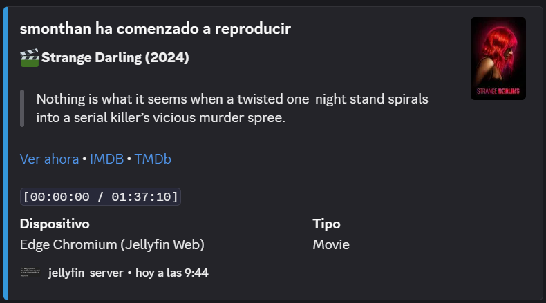
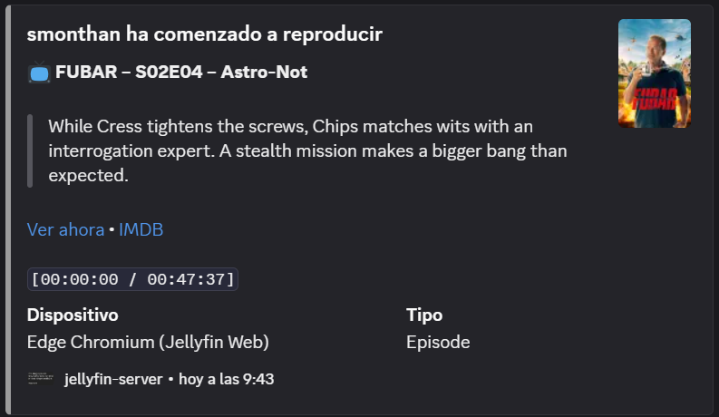
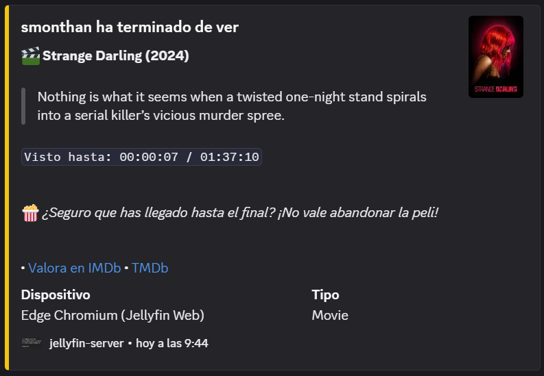
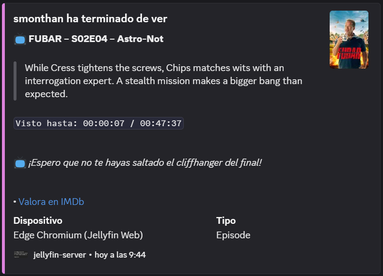
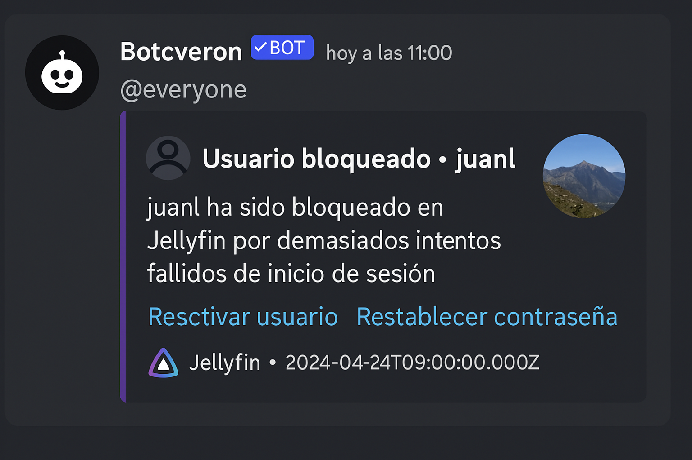

# Plantillas de Webhook para Jellyfin en Español

Este repositorio incluye plantillas personalizadas para el plugin **Webhook** de Jellyfin, diseñadas para ofrecer notificaciones atractivas y funcionales en servidores de Discord.  

📦 Incluye:

- Playback Start (películas y episodios)
- Playback Stop (películas y episodios)
- Item Added (nuevo contenido)
- User Blocked (bloqueo por intentos fallidos)

---

## ✨ Vista Previa

<table>
  <tr>
    <td><strong>Inicio (Película)</strong></td>
    <td><strong>Inicio (Episodio)</strong></td>
  </tr>
  <tr>
    <td></td>
    <td></td>
  </tr>
  <tr>
    <td><strong>Fin (Película)</strong></td>
    <td><strong>Fin (Episodio)</strong></td>
  </tr>
  <tr>
    <td></td>
    <td></td>
  </tr>
  <tr>
    <td colspan="2"><strong>Usuario Bloqueado</strong></td>
  </tr>
  <tr>
    <td colspan="2"></td>
  </tr>
</table>

---

## 📁 Estructura

- `templates/*.json` → Plantillas para usar en Jellyfin Webhook
- `docs/*.png` → Previews visuales para cada plantilla
- `docs/index.html` → Página de demostración

---

## 🙌 Créditos

Hecho con ❤️ por [@MonthanEvE](https://github.com/MonthanEvE), con la ayuda de Copilot, la comunidad y los ejemplos de [@seanmcbroom](https://github.com/seanmcbroom).

---

## 🧪 ¿Quieres aportar?

Las pull requests y mejoras son bienvenidas, especialmente para internacionalización, nuevas plantillas o soporte de embeds avanzados.
