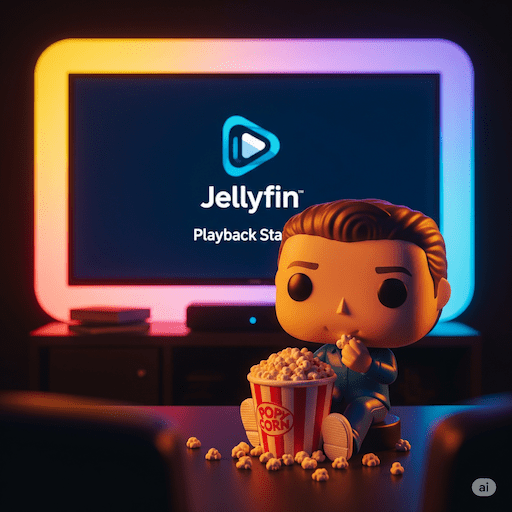
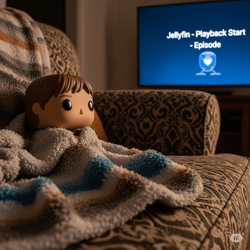

# 🎬 Jellyfin Discord Webhook Templates

Plantillas enriquecidas y personalizadas para enviar notificaciones de Jellyfin a Discord mediante Webhooks.

Incluye eventos listos para usar en español con:

- ✔️ Formato visual más limpio
- 🍿 Enlaces automáticos a IMDb y TMDb
- 📺 Imágenes diferenciadas por tipo de evento
- 🎯 Mensajes más expresivos para reproducción iniciada, detenida, contenido añadido y usuario bloqueado

---

## 🚀 Contenido incluido

| Evento | Archivo | Descripción |
|---|---|---|
| Item Added | `item-added.json` | Notifica cuando se añade una película o episodio |
| Playback Start | `playback-start.json` | Notifica cuando alguien empieza a reproducir una película o episodio |
| Playback Stop | `playback-stop.json` | Informa cuando se detiene o finaliza una reproducción |
| User Locked | `user-locked.json` | Notifica cuando un usuario queda bloqueado |

---

## ✨ Requisitos

- Jellyfin 10.x o superior
- Plugin [Discord Webhooks for Jellyfin](https://github.com/seanmcbroom/jellyfin-discord-webhooks)
- Un webhook de Discord ya configurado

---

## 🛠️ Cómo usar

1. Abre la configuración del plugin de Webhooks en tu servidor Jellyfin.
2. Crea o edita un webhook para el evento que quieras personalizar.
3. Abre el archivo JSON correspondiente de este repositorio.
4. Copia su contenido completo.
5. Pégalo en el campo de plantilla del plugin.
6. Guarda los cambios.

---

## 🧪 Ejemplos visuales

### 🎬 Nuevo contenido añadido

| Película | Episodio |
|---|---|
|  |  |

### ▶️ Reproducción iniciada

| Película | Episodio |
|---|---|
|  |  |

### ⏹️ Reproducción detenida

| Película | Episodio |
|---|---|
|  |  |

### 🔒 Usuario bloqueado

---

## 🌐 Vista web

- `index.html` incluido en el repositorio para vista de demostración
- versión publicada en tu servidor: `https://monthanin.com/github/`

---

## 📦 Archivos del repositorio

### Templates JSON
- `item-added.json`
- `playback-start.json`
- `playback-stop.json`
- `user-locked.json`

### Recursos visuales
- `jellyfin-icon.png`
- `jellyfin-added-movie.png`
- `jellyfin-episode-added.png`
- `jellyfin-playback-start-episode.png`
- `jellyfin-playback-start-movie.png`
- `jellyfin-playback-stop-episode.png`
- `jellyfin-playback-stop-movie.png`
- `jellyfin-user-blocked.png`

---

## 📣 Créditos

Personalización y adaptación realizada por MonthanIn a partir del trabajo original del plugin de [seanmcbroom](https://github.com/seanmcbroom/jellyfin-discord-webhooks).

---

## ⚠️ Licencia

MIT